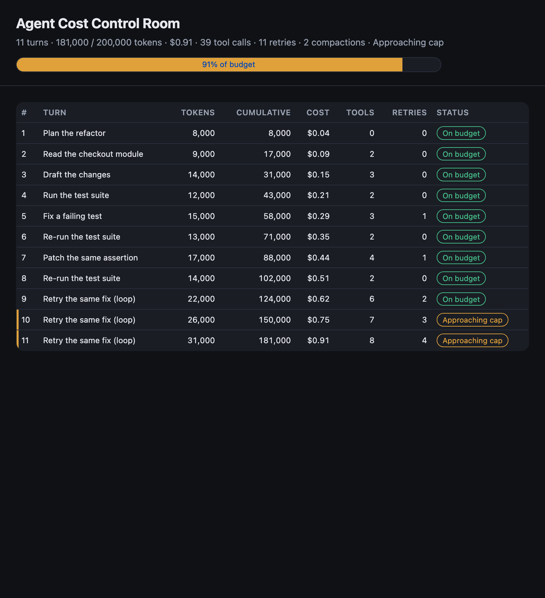

# Cap an Autonomous Agent with Token Budgets and a Kill-Switch

**In this codelab you give an autonomous Antigravity SDK agent a hard token budget it cannot exceed**, building a monitor that reads live cumulative token usage, warns as it nears the cap, and trips a deny-all kill-switch that halts a runaway loop before it burns the budget.

Give an autonomous agent a token budget it cannot exceed, using the **Antigravity
SDK** (Python). A monitor reads the SDK's **live cumulative token usage**
(`agent.conversation.total_usage`, including Gemini's reasoning tokens), warns as
it nears the cap, and — once the budget is exhausted — a pre-tool Decide hook
**denies every further tool call**, halting a runaway loop. A **Cost Control
Room** dashboard renders the spend.

**▶️ Start the codelab:** https://happycode.studio/gde-sprint-26-budgets-public/

## What you'll build

A budget monitor + automated kill-switch, with a FinOps dashboard that shows a
build looping on the same fix and climbing toward its cap:



## Get the starter files

This repo also hosts the published codelab. Pull down just the `workspace/`
folder with a sparse checkout — that folder is your working directory:

```bash
git clone --no-checkout --depth 1 https://github.com/evanca/gde-sprint-26-budgets-public.git
cd gde-sprint-26-budgets-public
git sparse-checkout init --cone
git sparse-checkout set workspace
git checkout
cd workspace
```

- `workspace/` — the Cost Control Room (your working directory): the dashboard, a
  per-turn ledger in local JSON, the budget rule briefs, and `monitor/` where the
  budget logic lives. `monitor/budget.py` starts as a stub (the offline tests are
  red); you implement it, then wire the kill-switch in `monitor/agent.py`.
- [`reference/`](./reference) — the completed end state, for comparison.

The budget logic is pure Python and verified offline with
`python -m unittest discover -s tests -p "test_*.py"` — no SDK or agent run
needed. Running the live agent needs the Antigravity SDK and credentials (a
Gemini API key, or a Google Cloud project via Vertex AI).

Follow the [codelab](https://happycode.studio/gde-sprint-26-budgets-public/) from
here.

---

Google Cloud credits were provided for this project as part of the Agentic Architect Sprint 2026.

#AgenticArchitect #GoogleAntigravity
